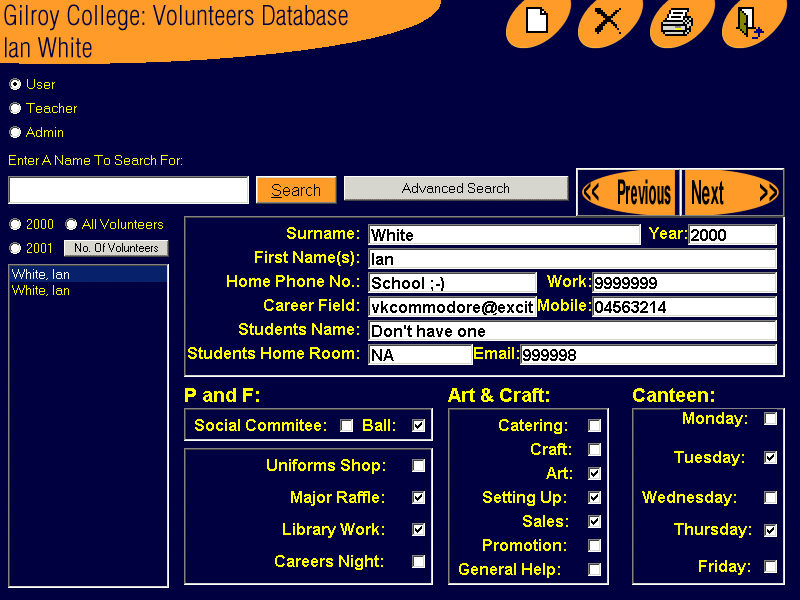



## A 0 0 Volunteers

### Description

This was a piece of software i did for my HSC major assesment, 93% cheerin! Anyway, i have put a fair bit of work into it, it still has bugs, coz i only finished it the other day i haven't had a chance to fully de-bug it. There are also some changes I would like to make in the near future, but it is basically finish, so please enjoy, let me know what u think, and PLEASE vote high, i would love to win this months comp :-)

The Admin Password and Teacher password are both "Gilroy"
 
### More Info
 
Passwords: gilroy

             |
---                |---
**Submitted On**   |2001-08-01 21:39:04
**By**             |[Ian White](https://github.com/Planet-Source-Code/PSCIndex/blob/master/ByAuthor/ian-white.md)
**Level**          |Advanced
**User Rating**    |4.1 (49 globes from 12 users)
**Compatibility**  |VB 5\.0, VB 6\.0, VBA MS Access
**Category**       |[Databases/ Data Access/ DAO/ ADO](https://github.com/Planet-Source-Code/PSCIndex/blob/master/ByCategory/databases-data-access-dao-ado__1-6.md)
**World**          |[Visual Basic](https://github.com/Planet-Source-Code/PSCIndex/blob/master/ByWorld/visual-basic.md)
**Archive File**   |[A 0 0 Volu25714912001\.zip](https://github.com/Planet-Source-Code/ian-white-a-0-0-volunteers__1-26861/archive/master.zip)

